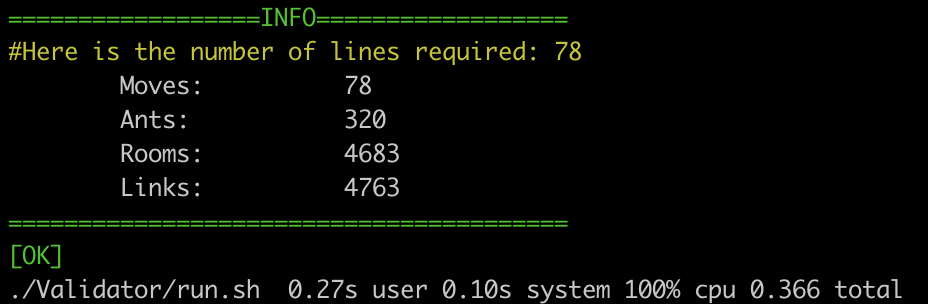

## Lem-in Project Summary
</p>
The goal of this project is to find the quickest way to get X ants across the map. <br>
Quickest way means the solution with the least number of lines (rounds).<br>
Some constraints apply:
* Only one ant per room (except for start and end).
* Ants can only move once per round.

The map consists of rooms and links. Each link is connected to 2 rooms, each room can have any number of links.
There is 1 start and 1 end room.

Your program will receive the data describing the map from the standard output
in the following format:
```c
5			//Ant amount
##start			//Next room is start room
start 0 0		//id x y
a 1 1
b 2 1
d 1 0
c 2 0
##end			//Next room is end room
sink 3 0
start-a			//Start room is linked to room a
start-d
a-d
a-c
a-b
b-c
b-sink
d-c
c-sink
```
The result from the above map, in correct format:
```
L1-d L2-a 
L1-c L2-b L3-d L4-a 
L1-sink L3-c L2-sink L4-b L5-d 
L3-sink L5-c L4-sink 
L5-sink 
```

## The Algorithm

I tried to come up with the solution my self instead of using an existing one, so the algorithm is more convoluted than it had to be.<br>
My algorithm starts with checking start and end rooms, which one has least amount of links.<br>
The amount is the theoretical highest possible path amount.<br>
Then it starts for start room moving to each connected room until one reaches the end room (BFS).<br>
It save the path that reached the end first and calculates how many moves current path configuration will take.<br>
If the highest possible path amount is higher that 1 it starts again.<br>
But this time it does not send to the room connected to start, which is already used by a saved path.<br>
If during this BFS it travels to a room that is used in a previous path it travels backwards on the previous path<br>
and tries to exit to a free room, if not possible the current path is terminated.<br>
If a path that has traveled backwards on a previous path reaches the end first, the current path and the <br>
backwards traveled path a split into to 2 separate new paths.<br>
When the ant moving amount start to rise the optimal path configuration has been found.<br> 

## Parsing

When reading large maps, each id is a string. This means each room has to be compared with already parsed rooms <br>
to find duplicates, and for each link 2 rooms have to be found from the rooms list. This takes a lot of time.<br>
To speed up the parsing I use a Red&Black binary tree, mostly because it had a useful [visualizer](https://www.cs.usfca.edu/~galles/visualization/RedBlack.html) to use when coding the functions.<br>
This lowers the string compares of the room names. For example:<br>
Compare 20 (1-20) rooms takes average 10.5 compares vs with R&B Tree 3.75.<br>
So when reading some of the larger maps that have 2953 rooms and 3006 links, the time saved is noticeable.<br>

## Compiling and Running the Program
```sh
git clone --recurse-submodules https://github.com/Epicurius/Lem-in.git
cd Lem-in && make && make -f Validator/Makefile

#	Help info for use & flags
./lem-in -h
#	To run the program with map (there are some in Validator/tests/..)
./lem-in < # MAP

#	The project has a validator that will return [OK] if the solution is correct
#	This will generate a random large map, solve it, check if valid and return core info.
./Validator/run.sh
```
<br>


## Conclusion

This was the first project where I learned how to use structs and lists. <br>
I had a lot of fun with the project (especially the optimizing part), but due to a team project I had to<br>
finnish the project prematurely. So the end result is not as polished as many of my other projects.<br>

